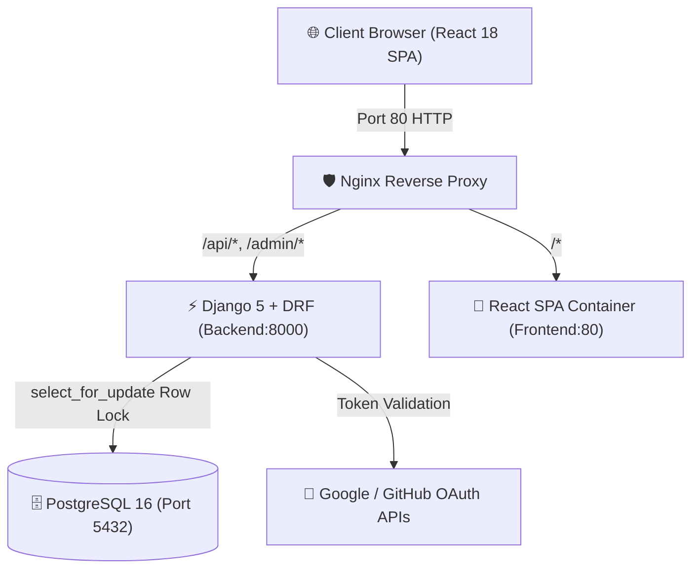

# 🚀 Ahoum Sessions Marketplace

[]()
[]()
[]()
[]()
[]()
[]()

A high-performance, concurrency-safe **Sessions Marketplace** where users authenticate via OAuth/JWT, browse and book workshop sessions with real-time seat inventory, and creators publish and manage offerings with attendee rosters.

Orchestrated with **Docker Compose & Nginx** for seamless single-port deployment on port 80 with PostgreSQL data persistence.

---

## 🌟 Key Highlights & Capabilities

- ⚡ **Zero-Oversubscription Concurrency Engine**: Guaranteed seat allocation safety using database row-level locking (`SELECT FOR UPDATE` inside `transaction.atomic()`) and partial database unique constraints (`UniqueConstraint(condition=Q(status='CONFIRMED'))`).
- 🔐 **Dual-Mode Authentication**: Native Google & GitHub OAuth token verification combined with an **Instant Evaluator Demo Sign-In** that issues real SimpleJWT access/refresh tokens for instant testing.
- 🎟️ **Live Seat Inventory & Progress Bars**: Real-time visualization of total vs. remaining capacity, instant status indicators (Available, Sold Out, Ended), and seat restoration upon cancellation.
- 👩‍🏫 **Creator Studio & Attendee Rosters**: Dedicated host dashboard to publish workshops, edit session metadata, set capacity limits, and inspect live attendee rosters (protected by role and object permissions).
- 🧭 **Evaluator Fast-Switch Toolbar**: Top sticky bar allowing reviewers to switch between **Demo User (Alex)**, **Demo Creator (Elena)**, **Demo Creator (Marcus)**, and **Guest Mode** with 1 click.
- 🐳 **Full Docker Orchestration**: 4 isolated microservices (Nginx Proxy, Django Backend, React Frontend, PostgreSQL 16) launching with one command.

---

## 📁 Repository Structure

```text
ahoum-sessions-marketplace/
├── backend/
│   ├── marketplace_core/      # Django settings, WSGI/ASGI, custom exception handler
│   ├── sessions_app/          # Sessions, bookings, concurrency service, serializers, views
│   │   ├── migrations/
│   │   ├── tests/             # Authorization, race conditions, concurrency tests
│   │   └── services.py        # select_for_update() transactional locking engine
│   ├── users/                 # Custom User model, OAuth views, demo auth, profile API
│   │   ├── migrations/
│   │   └── tests.py           # Authentication, JWT issuance, profile unit tests
│   ├── Dockerfile             # Multi-stage production backend container
│   ├── entrypoint.sh          # DB wait-for-it & automated migrations runner
│   ├── manage.py
│   ├── requirements.txt       # Frozen Python dependencies
│   └── run_concurrency_demo.py # Standalone 10-thread parallel race simulator
│
├── frontend/
│   ├── src/
│   │   ├── api/               # Axios/Fetch client with automatic JWT auto-refresh
│   │   ├── components/        # Navbar, EvaluatorBanner, AuthModal, CreateEditSessionModal
│   │   ├── context/           # AuthContext (role management), ToastContext
│   │   ├── pages/             # CatalogPage, SessionDetailPage, CreatorDashboard, UserDashboard, ProfilePage
│   │   └── index.css          # Glassmorphism aesthetic with CSS variables
│   ├── public/
│   ├── Dockerfile             # Multi-stage Nginx-powered static frontend build
│   ├── package.json
│   └── vite.config.js
│
├── nginx/
│   ├── nginx.conf             # Reverse proxy routing /api/* to backend:8000 and /* to frontend:80
│   └── Dockerfile
│
├── docker-compose.yml         # 4-container production topology with named DB volume
├── .env.example               # Environment variables template
├── README.md                  # System architecture, quickstart, API documentation
├── DECISIONS.md               # Deep dive into concurrency locking & architectural trade-offs
├── DEBUGGING.md               # Real debugging logs, root-cause analyses, and resolutions
├── PROMPT_LOG.md              # AI prompt supervision history & engineering corrections
├── pytest.ini                 # Pytest runner configuration
└── .gitignore                 # Comprehensive ignore rules
```

---

## 🚀 Quickstart (Run with One Command)

The entire multi-container stack can be started with a single command:

```bash
# 1. Clone the repository
git clone https://github.com/uttam-kalsariya/ahoum-sessions-marketplace.git
cd ahoum-sessions-marketplace

# 2. Start all containers (PostgreSQL, Django Backend, React Frontend, Nginx Proxy)
docker compose up --build
```

Once started, open your browser at:
- 🌐 **Web Application**: [http://localhost](http://localhost) (Port 80)
- 🔌 **Backend API Root**: [http://localhost/api/](http://localhost/api/)
- 🛠️ **Django Admin**: [http://localhost/admin/](http://localhost/admin/)
- 💓 **API Health Check**: [http://localhost/api/health/](http://localhost/api/health/)

> [!TIP]
> **Instant Evaluator Sign-In**: Use the **Evaluator Toolbar** at the top of the webpage to switch between **Demo User (Alex)** and **Demo Creator (Elena)** instantly without configuring third-party OAuth client keys!

---

## 🧪 Automated Testing & Concurrency Verification

### 1. Run Complete Automated Test Suite (15 Tests)

```bash
# In Python virtual environment:
python backend/manage.py test sessions_app.tests users.tests --noinput

# Or with pytest:
pytest
```

**Test Suite Coverage Summary**:
- ✅ `sessions_app.tests.test_authorization`: Standard users blocked from creating sessions (`403 Forbidden`), creators prevented from mutating other creators' sessions, unauthenticated token rejection (`401 Unauthorized`), booking past sessions rejection, duplicate booking prevention, self-booking rejection, and seat cancellation restoration.
- ✅ `sessions_app.tests.test_concurrency`: Multi-threaded simultaneous booking race condition on 1-seat capacity (10 threads), simultaneous duplicate booking by same user (5 threads), and 2-thread explicit race test.
- ✅ `users.tests`: Demo login for `USER` and `CREATOR` roles with cryptographically signed SimpleJWTs, custom evaluator email creation, authenticated profile inspection/patching, and OAuth config discovery.

```text
Ran 15 tests in 1.508s
OK (15/15 tests passed)
```

---

### 2. Run Standalone Concurrency Race Simulator

We provide an interactive script that spawns 10 parallel OS threads attempting to book a 1-seat session at the exact same millisecond:

```bash
# Run simulator:
python backend/run_concurrency_demo.py

# Or inside running Docker container:
docker compose exec backend python run_concurrency_demo.py
```

**Simulator Output**:
```text
======================================================================
 🚀 AHOUM SESSIONS MARKETPLACE - CONCURRENCY RACE CONDITION TEST 
======================================================================
[1] Created Test Session: '[CONCURRENCY RACE] Exclusive 1-Seat High-Frequency Workshop'
    - Total Capacity: 1 seat
    - Initial Remaining Seats: 1

[2] Simulating 10 parallel threads firing at the exact same millisecond...
✅ [Thread #06] CONFIRMED -> Booking #2 acquired in 177.95ms
❌ [Thread #02] REJECTED  -> Session is fully booked. No remaining seats available.
❌ [Thread #01] REJECTED  -> Session is fully booked. No remaining seats available.
❌ [Thread #05] REJECTED  -> Session is fully booked. No remaining seats available.
...
======================================================================
 📊 VERIFICATION & INVARIANT SUMMARY 
======================================================================
 • Total Concurrent Requests Fired: 10
 • Successful Bookings Confirmed:   1
 • Rejected (Over-capacity) Count:  9
 • Confirmed Bookings in Database:  1
 • Session Capacity:                1
 • Remaining Seats:                 0

🎉 RESULT: PASS! Strict database row-locking prevented any oversubscription.
```

---

## 🏗️ System Architecture & Data Flow



### Architecture Highlights:
1. **Nginx Reverse Gateway (`proxy`)**: Single entry point on port 80 routing `/api` and `/` seamlessly, eliminating cross-origin preflight requests (CORS overhead) in production.
2. **Backend API (`backend`)**: Django 5 + Django REST Framework + SimpleJWT. Enforces role-based permissions (`IsCreator`, `IsSessionOwner`), custom exception formatting, and transactional row locking.
3. **Frontend Application (`frontend`)**: React 18 + Vite with glassmorphic dark theme, responsive navigation, modal dialogs, and JWT auto-refresh interceptors.
4. **PostgreSQL Database (`db`)**: PostgreSQL 16 Alpine backed by named volume `ahoum_marketplace_postgres_data` ensuring session and booking data persist across container restarts.

---

## 💾 Database Persistence

PostgreSQL data is persisted using a named Docker volume:
```yaml
volumes:
  postgres_data:
    name: ahoum_marketplace_postgres_data
```
- When containers are stopped via `docker compose down` or restarted via `docker compose restart`, all created sessions, user profiles, and bookings survive intact.
- To perform a complete database wipe and fresh re-seed: `docker compose down -v`.

---

## 📖 API Endpoints Reference

| Method | Endpoint | Access | Description |
| :--- | :--- | :--- | :--- |
| `GET` | `/api/health/` | Public | Service health check & version info |
| `POST` | `/api/auth/demo/` | Public | Instant Demo User/Creator login (returns JWTs) |
| `POST` | `/api/auth/google/` | Public | Google OAuth token exchange for JWTs |
| `POST` | `/api/auth/github/` | Public | GitHub OAuth code exchange for JWTs |
| `POST` | `/api/auth/token/refresh/` | Public | SimpleJWT access token refresh |
| `GET/PATCH`| `/api/auth/profile/` | Authenticated | View or update user profile and active role |
| `GET` | `/api/auth/config/` | Public | Public OAuth client configuration |
| `GET` | `/api/sessions/` | Public | Browse public session catalog (search, upcoming filter) |
| `POST` | `/api/sessions/` | Creator Only | Publish a new workshop session |
| `GET` | `/api/sessions/<id>/` | Public | View session details (includes attendees if host) |
| `PATCH/DEL`| `/api/sessions/<id>/` | Creator (Owner)| Modify or delete own session |
| `POST` | `/api/sessions/<id>/book/` | Authenticated | **Concurrency-safe transactional seat booking** |
| `GET` | `/api/sessions/my-sessions/`| Creator Only | Creator studio list with confirmed attendee counts |
| `GET` | `/api/bookings/my-bookings/`| Authenticated | View user active & past booking passes |
| `POST` | `/api/bookings/<id>/cancel/`| Authenticated | Cancel booking & release seat back to inventory |

---

## 📚 Mandatory Assignment Documentation

- 📐 **[DECISIONS.md](file:///e:/Ahoum/DECISIONS.md)**: In-depth technical rationale covering `select_for_update()` row-level locking, database constraints vs application checks, GitHub vs Google OAuth trade-offs, and Nginx reverse proxy architecture.
- 🐛 **[DEBUGGING.md](file:///e:/Ahoum/DEBUGGING.md)**: Real debugging incident reports covering SQLite connection reuse in thread pools, `lucide-react` icon deprecation fixes, and in-memory test database isolation.
- 🤖 **[PROMPT_LOG.md](file:///e:/Ahoum/PROMPT_LOG.md)**: Complete record of AI model interactions, tool usages, prompt history, and engineering corrections applied during development.

---

## 🔮 Known Limitations & Future Improvements

If given additional development time, the following enhancements would be added:
1. **WebSocket / Server-Sent Events (SSE)**: Stream real-time seat decrement events across all open browser tabs without polling or manual refresh.
2. **Automated Waitlist Queue**: Allow attendees to queue for sold-out sessions and automatically promote the next in line upon cancellation.
3. **Stripe Payment Gateway**: Escrow holds and transactional payment capture during the seat reservation pipeline.
4. **Calendar Export (.ics)**: One-click export of confirmed sessions to Google Calendar, Apple Calendar, and Outlook.

---

## 📄 License

This project is licensed under the MIT License.
