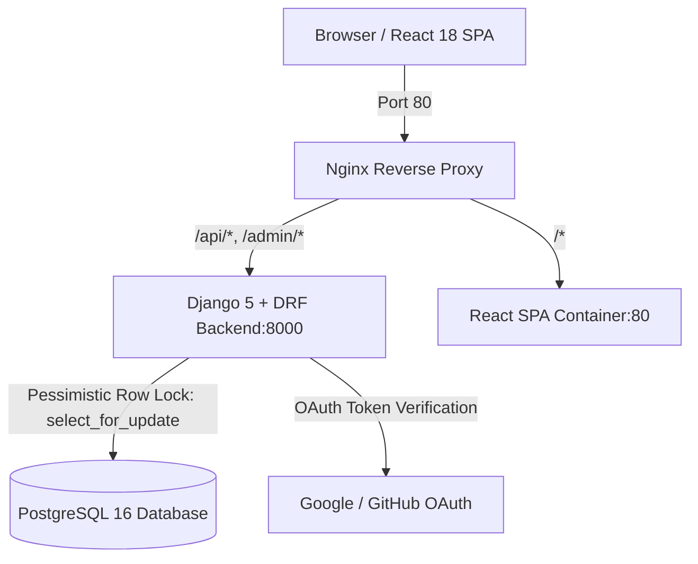

# Ahoum Sessions Marketplace

[]()
[]()
[]()
[]()

A high-performance, concurrency-safe **Sessions Marketplace** where users authenticate via OAuth/JWT, browse and book workshop sessions with real-time seat inventory, and creators publish and manage offerings with attendee rosters.

Built with **Django REST Framework**, **React + Vite**, **PostgreSQL 16**, and orchestrated with **Docker Compose & Nginx**.

---

## Quickstart (Run with One Command)

The entire multi-container stack can be started with a single command:

```bash
# 1. Clone the repository
git clone https://github.com/uttam-kalsariya/ahoum-sessions-marketplace.git
cd ahoum-sessions-marketplace

# 2. Start all containers (PostgreSQL, Django Backend, React Frontend, Nginx Proxy)
docker compose up --build
```

Once running, access the application at:
- **Web Application**: [http://localhost](http://localhost) (or [http://localhost:80](http://localhost:80))
- **Backend API**: [http://localhost/api/](http://localhost/api/)
- **Django Admin**: [http://localhost/admin/](http://localhost/admin/)
- **API Health Check**: [http://localhost/api/health/](http://localhost/api/health/)

> [!TIP]
> **Instant Evaluator Sign-In**: Click **Sign In** in the top navigation and select **Instant Demo Sign-in** to test both **User (Alex)** and **Creator (Elena)** roles immediately without needing live third-party OAuth keys!

---

## Running Automated Tests & Concurrency Race Condition Demo

### 1. Run Complete Automated Test Suite (9 Tests)
```bash
# In Python virtual environment:
python backend/manage.py test sessions_app.tests users.tests

# Or inside running Docker backend container:
docker compose exec backend python manage.py test sessions_app.tests users.tests
```

### 2. Run Standalone Concurrency Race Simulator
We provide an interactive script that spawns 10 parallel threads attempting to book a 1-seat session at the exact same millisecond:
```bash
# Run simulator:
python backend/run_concurrency_demo.py

# Or inside Docker:
docker compose exec backend python run_concurrency_demo.py
```

**Simulator Output**:
```text
======================================================================
 🚀 AHOUM SESSIONS MARKETPLACE - CONCURRENCY RACE CONDITION TEST 
======================================================================
[1] Created Test Session: '[CONCURRENCY RACE] Exclusive 1-Seat High-Frequency Workshop'
    - Total Capacity: 1 seat
    - Initial Remaining Seats: 1

[2] Simulating 10 parallel threads firing at the exact same millisecond...
✅ [Thread #06] CONFIRMED -> Booking #2 acquired in 177.95ms
❌ [Thread #02] REJECTED  -> Session is fully booked. No remaining seats available.
❌ [Thread #01] REJECTED  -> Session is fully booked. No remaining seats available.
...
======================================================================
 📊 VERIFICATION & INVARIANT SUMMARY 
======================================================================
 • Total Concurrent Requests Fired: 10
 • Successful Bookings Confirmed:   1
 • Rejected (Over-capacity) Count:  9
 • Confirmed Bookings in Database:  1
 • Session Capacity:                1
 • Remaining Seats:                 0

🎉 RESULT: PASS! Strict database row-locking prevented any oversubscription.
```

---

## System Architecture & Data Flow



### Key Components:
1. **Frontend Container (`frontend`)**: React 18 + Vite SPA served via Nginx with responsive glassmorphism UI, real-time inventory bars, and JWT auto-refresh interceptors.
2. **Backend Container (`backend`)**: Django 5 + Django REST Framework + Gunicorn. Enforces role authorization, concurrency locking, and token validation.
3. **Database Container (`db`)**: PostgreSQL 16 Alpine with named volume persistence.
4. **Reverse Proxy Container (`proxy`)**: Nginx routing `/api` and `/` seamlessly on port 80, eliminating CORS overhead in production.

---

## Database Persistence

PostgreSQL data is persisted using a named Docker volume:
```yaml
volumes:
  - postgres_data:/var/lib/postgresql/data
```
- When containers are stopped via `docker compose down` or restarted via `docker compose restart`, all created sessions, user profiles, and bookings survive intact in the `ahoum_marketplace_postgres_data` volume.
- To reset the database volume if desired: `docker compose down -v`.

---

## API Endpoints Reference

| Method | Endpoint | Access | Description |
| :--- | :--- | :--- | :--- |
| `GET` | `/api/health/` | Public | Service health check |
| `POST` | `/api/auth/demo/` | Public | Instant Demo User/Creator login (returns JWTs) |
| `POST` | `/api/auth/google/` | Public | Google OAuth token exchange for JWTs |
| `POST` | `/api/auth/github/` | Public | GitHub OAuth code exchange for JWTs |
| `POST` | `/api/auth/token/refresh/` | Public | SimpleJWT access token refresh |
| `GET/PATCH`| `/api/auth/profile/` | Authenticated | View or update user profile and role |
| `GET` | `/api/sessions/` | Public | Browse public session catalog (search, filter) |
| `POST` | `/api/sessions/` | Creator Only | Publish a new session |
| `GET` | `/api/sessions/<id>/` | Public | View session details |
| `PATCH/DEL`| `/api/sessions/<id>/` | Creator (Owner)| Modify or delete own session |
| `POST` | `/api/sessions/<id>/book/` | Authenticated | **Concurrency-safe booking action** |
| `GET` | `/api/sessions/my-sessions/`| Creator Only | Creator dashboard with attendee roster |
| `GET` | `/api/bookings/my-bookings/`| Authenticated | View active & past bookings |
| `POST` | `/api/bookings/<id>/cancel/`| Authenticated | Cancel booking & restore seat capacity |

---

## Mandatory Evaluation Documentation

- [DECISIONS.md](file:///e:/Ahoum/DECISIONS.md): In-depth analysis of concurrency locking (`select_for_update`), database vs. application invariants, and why frontend checks are insufficient.
- [DEBUGGING.md](file:///e:/Ahoum/DEBUGGING.md): Real debugging logs covering multi-threaded SQLite vs PostgreSQL connection behavior and Vite icon build resolutions.
- [PROMPT_LOG.md](file:///e:/Ahoum/PROMPT_LOG.md): AI interaction history and concrete examples of engineering supervision.

---

## Known Limitations & Future Improvements

If given an additional day of development, the following enhancements would be prioritized:
1. **WebSocket / Server-Sent Events (SSE)**: Stream live seat inventory updates to open browser tabs in real-time so seats decrement dynamically across users without page refreshes.
2. **Waitlist & Queuing System**: Allow attendees to join an automated waitlist when a session is sold out, automatically booking the next user in queue upon cancellation.
3. **Stripe / Payment Gateway Integration**: Connect real payment intents into the transactional booking pipeline with webhook confirmation and escrow hold.
4. **Calendar Export (.ics)**: One-click export of confirmed sessions to Google Calendar / Apple Calendar.
